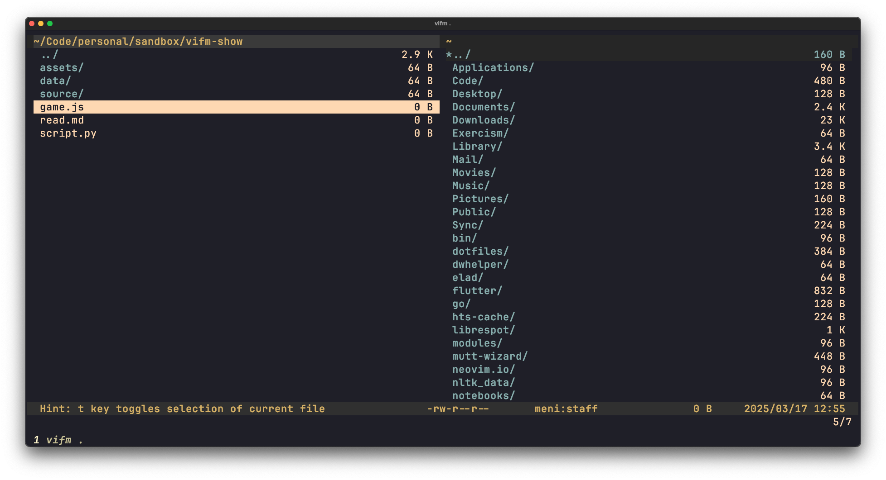

# Kanagawa Vifm Colorscheme

A **Kanagawa-inspired** color scheme for [vifm](https://github.com/vifm/vifm), 
inspired by [kanagawa.nvim](https://github.com/rebelot/kanagawa.nvim).

## Preview



## Installation

Copy the `colors/kanagawa.vifm` file into your `~/.config/vifm/colors/` directory:

```bash
curl -o ~/.config/vifm/colors/kanagawa.vifm \
     https://raw.githubusercontent.com/menisadi/kanagawa.vifm/main/colors/kanagawa.vifm
```

Then, add this line to your vifmrc:

```vimscript
colorscheme kanagawa
```

If the line exist place `kanagawa` as the first color scheme on the themes list.
